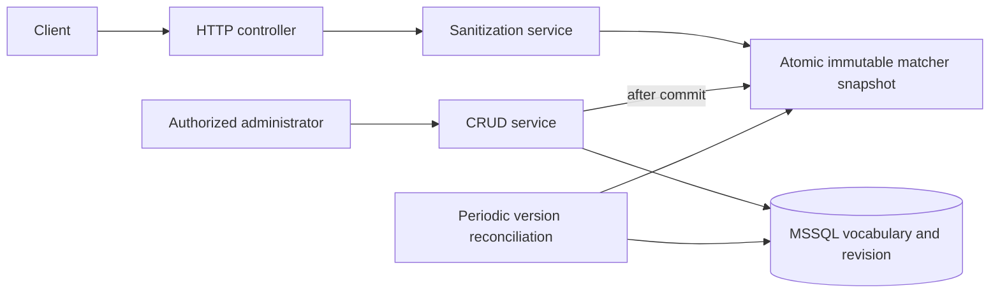

# Flash Sensitive Words API

Java 21 / Spring Boot 3.5.16 REST service that replaces configured sensitive terms with stars. Microsoft SQL Server stores the vocabulary; messages are matched in memory. Administrative edits commit a new vocabulary version, then publish an immutable local matcher.

[Quick start](#quick-start) · [Walkthrough](#five-minute-walkthrough) · [Matching](#matching-contract) · [API](#api) · [Consistency](#transactions-and-configuration-consistency) · [Tests](#testing-and-verification) · [Performance](#performance-what-would-enhance-this-project) · [Production](#production-deployment)

## Quick start

With Docker Desktop/Engine running in Linux-container mode:

```sh
docker compose up --build -d --wait --wait-timeout 180
```

The initial image build can take several minutes to download Maven dependencies. The wait timeout applies to container health after the build. SQL Server needs an x86-64 host; allocate at least 4 GB to Docker, preferably 6 GB when running integration tests too. SQL Server Developer edition is for development/testing only; starting the container accepts Microsoft's license terms.

Compose creates the application database, Flyway applies migrations and preloads all 228 supplied entries. An exited `db-init` container with code 0 is normal. The application container health check tests **liveness**; confirm **readiness** before sending traffic.

| Resource | Local URL |
|---|---|
| Swagger UI | http://localhost:8080/swagger-ui.html |
| OpenAPI JSON | http://localhost:8080/v3/api-docs |
| Readiness | http://localhost:8080/actuator/health/readiness |
| Liveness | http://localhost:8080/actuator/health/liveness |
| Dependency health | http://localhost:8080/actuator/health |

```sh
curl --fail http://localhost:8080/actuator/health/readiness
curl -sS http://localhost:8080/api/v1/sanitize -H 'Content-Type: application/json' -d '{"text":"You need to create a string"}'
```

```json
{"original":"You need to create a string","sanitized":"You need to ****** a string"}
```

PowerShell equivalent:

```powershell
Invoke-RestMethod http://localhost:8080/actuator/health/readiness
Invoke-RestMethod http://localhost:8080/api/v1/sanitize -Method Post -ContentType 'application/json' -Body '{"text":"You need to create a string"}'
```

Both exposed ports bind to loopback. Local mode intentionally permits unauthenticated requests. Production mode requires JWTs and different database settings.

## Five-minute walkthrough

1. Start Compose, open Swagger and run the email example above.
2. Run the PDF regression: `SELECT * FROM sensitiveWords` → `****** * FROM sensitiveWords`.
3. Create `CONFIDENTIAL`, sanitize it, rename it to `CLASSIFIED`, then delete it. Explain the version-row transaction and publication after commit.
4. Show a duplicate 409, malformed request 400, and the generated response schemas.
5. Run `./mvnw clean verify -Pintegration` and explain the rollback, uncertain-commit and two-instance tests.
6. Explain phrase precedence, Unicode policy, bounded stale configuration, last-write-wins edits, and production access controls.

The optional automated local walkthrough `python scripts/smoke.py` requires Python 3 and creates/deletes its own uniquely named term. It also checks strict JSON, pagination, timestamps and OpenAPI. It is intended for the unauthenticated local stack.

## Assessment requirements

The original [PDF](docs/assessment/Interview-SqlWords.pdf) and [word list](docs/assessment/sql_sensitive_list.txt) are retained. MSSQL follows the email requirement even though the PDF allows a database of choice.

| Flash requirement | Implementation |
|---|---|
| Java Spring Boot REST | Java 21, Boot 3.5.16, versioned endpoints and explicit record DTOs |
| Sanitize an incoming string | `POST /api/v1/sanitize`, original and sanitized fields |
| Manage sensitive words | Create, read, paginated list, update and delete |
| MSSQL persistence | SQL Server 2022 CU26, JPA, Microsoft JDBC, Flyway |
| Swagger annotations | Springdoc 2.8.17, operations, parameters, request constraints, headers and error responses |
| Appropriate unit tests | JUnit, Mockito, MockMvc, security tests and JaCoCo |
| Performance enhancements | Implemented in-memory matching and repeatable JMH profile; discussion below |
| Additional enhancements | Implemented controls and remaining platform work explicitly separated below |
| Production walkthrough | Concrete identity, migration, health, rollout and recovery policies below |
| Git submission | Logical commits; publish to a repository accessible to Flash and provide that URL |

Spring Boot manages platform dependency versions. Springdoc 2.8.x follows its [Boot 3.5 compatibility matrix](https://springdoc.org/v2/#what-is-the-compatibility-matrix-of-springdoc-openapi-with-spring-boot). Reassess dependency support and vulnerability findings before production release.

Two explicit security overrides are tested: Tomcat 10.1.59 and Microsoft JDBC 13.4.0.jre11. The initial image scan flagged Tomcat advisories affecting the BOM's 10.1.55. Apache's 10.1.58 candidate did not pass its release vote, so the published 10.1.59 is used. The JDBC update also removes an ambiguous scanner version match against the older driver's JRE-suffixed version. See [Apache advisories](https://tomcat.apache.org/security-10.html) and [Microsoft's 13.4 release](https://techcommunity.microsoft.com/blog/sqlserver/announcing-the-general-availability-of-microsoft-jdbc-driver-13-4-for-sql-server/4503168). Remove overrides once the Boot BOM incorporates equivalent or newer patched versions.

## Architecture



Controllers handle HTTP contracts. Application services own orchestration and transactions. The `domain` package contains shared term rules; `matcher` contains matching and snapshot publication; `persistence` contains JPA. DTOs do not depend on entities. Configuration contains serialization, health and security adapters.

Each sanitize request reads one immutable snapshot and creates its own regex matcher. It does not query MSSQL or acquire an application write lock. Original and sanitized messages are not routinely logged. This implementation returns both the original and sanitized values in an explicit response DTO for API clarity. Consumers should avoid logging message payloads containing potentially sensitive content.

## Matching contract

Terms are literal strings. Surrounding Unicode whitespace, including non-breaking spaces, is removed. Empty/control-containing terms are rejected. All stored terms are active; DELETE physically removes a term.

Both term identity and incoming text use the same **simple per-code-point case fold**: `lower(upper(codePoint))`. This avoids expanding characters such as `İ` and handles sigma variants consistently. It does not use locale-sensitive casing or multi-character linguistic equivalence: `ß` is not `ss`. Composed/decomposed accents, transliteration and visually similar characters remain distinct.

Simple folding preserves UTF-16 offsets on Java 21. An exhaustive test checks every runtime code point for this property and folding idempotence, protecting the original-string replacement offsets during JDK upgrades. Matching returns the original spelling outside masked spans.

Boundaries treat Unicode letters, numbers, combining marks and connector punctuation as token characters. Consequently `ORDER` does not match inside `preorder`; `CREATE` does not match `CREATE_table`, `CREATE2` or `éCREATE`. Phrase spacing is literal: `top secret` differs from `top  secret`.

At the same starting position, the **shortest complete matching term wins**. Matches are non-overlapping and processed left to right. With `foo` and `foo bar`, the result for `foo bar` is `*** bar`. This may shadow a configured phrase and is an explicit product assumption.

The supplied vocabulary contains both `SELECT` and `SELECT * FROM`, but Flash's PDF explicitly expects `****** * FROM sensitiveWords`. That example takes precedence. The longer phrase remains in the database; deleting `SELECT` lets it match. `FROM` is not independently seeded. Changing precedence requires changing this policy and its tests, not silently replacing the supplied dataset.

Each non-whitespace Unicode code point inside a match becomes one star; whitespace is preserved. An emoji produces one star, so response UTF-16 length need not equal input length.

| Input with the supplied vocabulary | Sanitized |
|---|---|
| `CREATE`, `create`, `CrEaTe` | `******` |
| `Please CREATE a TABLE` | `Please ****** a *****` |
| `CREATE, DROP!` | `******, ****!` |
| `preorder ORDER` | `preorder *****` |
| `SELECT * FROM sensitiveWords` | `****** * FROM sensitiveWords` |

This is configurable content filtering, not SQL-injection protection or comprehensive adversarial moderation. Database clients must still use parameterized SQL.

## API

Bodies must be one JSON object with unique property names and actual string values. Unknown fields, numeric/boolean coercion, duplicate properties and trailing JSON are rejected. Text must be nonblank and within the configured UTF-16 limit. Terms are limited to 200 UTF-16 units including surrounding whitespace at the HTTP boundary; normalization then trims.

| Method | Path | Success |
|---|---|---|
| POST | `/api/v1/sanitize` | 200, original and sanitized |
| POST | `/api/v1/internal/sensitive-words` | 201, DTO and relative `Location` URI |
| GET | `/api/v1/internal/sensitive-words?page=0&size=20` | 200, content and page metadata |
| GET | `/api/v1/internal/sensitive-words/{id}` | 200, DTO |
| PUT | `/api/v1/internal/sensitive-words/{id}` | 200, updated DTO |
| DELETE | `/api/v1/internal/sensitive-words/{id}` | 204 |

IDs are positive. Pages are zero-based, size 1–100, sorted by ID; `page * size` must not exceed 2,147,483,647. Spring Data `PagedModel` supplies a stable page representation.

```sh
curl -i http://localhost:8080/api/v1/internal/sensitive-words -H 'Content-Type: application/json' -d '{"word":"CONFIDENTIAL"}'
# Replace 229 with the returned ID.
curl http://localhost:8080/api/v1/internal/sensitive-words/229
curl -X PUT http://localhost:8080/api/v1/internal/sensitive-words/229 -H 'Content-Type: application/json' -d '{"word":"CLASSIFIED"}'
curl -i -X DELETE http://localhost:8080/api/v1/internal/sensitive-words/229
```

Errors use `application/problem+json`: 400 validation/JSON, 401 missing or invalid production token, 403 insufficient scope, 404 missing resource, 409 duplicate, 413 oversized body, 415 unsupported request media type, 406 unsupported response media type, 503 unavailable dependency/matcher, and 500 unexpected failure. Field/parameter violations contain names and safe messages, never rejected values. A repeated DELETE returns 404.

```json
{"type":"about:blank","title":"Bad Request","status":400,"detail":"Request fields failed validation","violations":[{"field":"word","message":"must not be blank"}]}
```

A streaming body filter bounds bytes before JSON parsing, including requests without Content-Length. The limit is `6 * maxMessageLength + 2048` (62,048 bytes by default), allowing escaped UTF-16 and JSON framing. Production ingress should also enforce body limits, rate limits and request deadlines.

## Transactions and configuration consistency

A singleton database revision row orders writers across instances. Every CRUD transaction first increments that row, then changes the vocabulary, reads/compiles the replacement and commits. Compilation failure rolls back both vocabulary and revision. Local publication happens after commit, under the same local monitor that orders administrative operations.

Reads of revision and vocabulary retain a shared revision-row lock until the refresh transaction ends. Writers always obtain that row first, so polling cannot pair an old vocabulary with a new revision. Polls normally read only the version and rebuild only when it changes.

Each instance polls every 30 seconds by default. This is eventual consistency across replicas: an update acknowledged by A may still be absent on B until its next successful poll. It is not globally immediate consistency. A trusted snapshot remains usable for at most 300 seconds since its last successful database confirmation. After that, readiness is down and sanitization returns 503. An expired snapshot can recover on a successful version confirmation.

A transaction/data-access failure invalidates the affected instance's snapshot conservatively because the database might have committed while its acknowledgement was lost. Reconciliation reloads confirmed state; it never replays the write. A caller receiving a failed write must inspect the resource before retrying. The test suite simulates a real commit followed by a thrown acknowledgement error.

Mutation/refresh methods reject ambient transactions rather than independently committing inside another service's transaction. Public reads use bounded read-only transactions. SQL defaults are: query/transaction 10 seconds, lock 5 seconds, cancellation 5 seconds, socket 20 seconds, login 10 seconds; pool acquisition is independently bounded at 5 seconds. These are starting operational budgets, not a strict end-to-end latency guarantee.

Vocabulary capacity defaults to 10,000. Full rebuilds remain appropriate for the supplied 228 terms and infrequent edits. Updates are **last-write-wins**; serialization does not detect stale administrator edits. A human editing workflow can add a version/ETag contract. This assessment intentionally does not add that API requirement.

## Database and migrations

V1 creates identity IDs, `NVARCHAR(200)` values, a binary-collated unique normalized key, blank checks and UTC `DATETIME2(6)` timestamps. Java timestamps use matching microsecond precision. Database constraints protect the normalized key; they do not independently implement Java Unicode normalization.

V2 inserts every supplied value exactly once. Tests compare all 228 values and normalized keys against the original source. Restarting does not restore deleted words.

V3 upgrades existing user-added terms to the new Unicode policy and creates the revision row. A newly exposed normalization collision aborts migration without deleting rows. Resolve duplicate terms with the previous application version, then retry. **The upgrade from V2 to V3 requires a maintenance window:** stop old writers before migration; old binaries do not participate in the revision protocol. Subsequent compatible releases can use rolling deployment.

Never edit an applied migration. The Java migration freezes its normalization algorithm and checksum. Hibernate validates schema; it does not create it.

The release job can run `./mvnw -B -ntp compile flyway:migrate` with `FLYWAY_URL`, `FLYWAY_USER` and `FLYWAY_PASSWORD` injected for the migration identity. The pinned Maven plugin loads both SQL and compiled Java migrations. `flyway:info` inspects migration status without applying changes. Keep migration secrets out of command arguments and logs.

Use the administrative API for all vocabulary changes. Direct SQL bypasses normalization and revision updates and is unsupported. Runtime grants are illustrated in [runtime-permissions.sql](deploy/runtime-permissions.sql); login/secret provisioning and a separate migration identity belong to the deployment platform.

## Local development and operations

No host JDK/Maven is needed for Docker. Host development uses JDK 21 and the Maven 3.9.11 wrapper, whose distribution SHA-256 is pinned.

```sh
docker compose up -d sqlserver
docker compose run --rm db-init
# Continue only if the initialization command exits successfully.
export DB_PASSWORD='FlashLocal_Only!2026'
./mvnw spring-boot:run
```

PowerShell:

```powershell
docker compose up -d sqlserver
docker compose run --rm db-init
if ($LASTEXITCODE -ne 0) { throw 'Database initialization failed' }
$env:DB_PASSWORD = 'FlashLocal_Only!2026'
.\mvnw.cmd spring-boot:run
```

Stop the Compose app first if it occupies port 8080: `docker compose stop app`. If overriding the SQL host port, also set the host application's DB_URL. POSIX users should stop if either Docker command fails.

| Variable | Default / purpose |
|---|---|
| DB_URL | Local MSSQL URL with encryption and development certificate trust |
| DB_USERNAME / DB_PASSWORD | Local username sa; password required outside Compose |
| DB_POOL_SIZE | 10 |
| SANITIZATION_MAX_MESSAGE_LENGTH | 10,000 UTF-16 units; range 1–1,000,000 |
| VOCABULARY_REFRESH_DELAY_MS | 30,000 milliseconds between completed polls |
| VOCABULARY_MAX_STALE_SECONDS | 300; range 1–86,400 |
| VOCABULARY_MAX_TERMS | 10,000; range 228–100,000 |
| MSSQL_SA_PASSWORD | Public development-only Compose password |
| MSSQL_PORT / APP_PORT | 1433 / 8080 |

Copy `.env.example` to `.env` for local Compose overrides. Secret file variants are ignored. Changing a password variable does not rotate an existing SQL login in the persisted volume.

```sh
docker compose ps -a
docker compose logs -f app
docker compose down
```

`down` preserves data. `docker compose down -v` intentionally deletes this local stack's database volume and all local CRUD edits. CI uses its own disposable stack.

The application image uses a non-root JRE runtime, pinned base digests and a stable JAR filename. Dependency/image updates should arrive through reviewed Dependabot changes. Package repositories used during image assembly remain an external build dependency; artifact promotion should use the same built image digest.

## Testing and verification

```sh
./mvnw clean verify
./mvnw clean verify -Pintegration
# Windows: .\mvnw.cmd clean verify -Pintegration
python scripts/smoke.py
```

The default suite requires no database or Docker. It covers literal matching, Unicode invariants, validation, HTTP contracts, security scopes, cache expiry, deterministic publication ordering, startup failure and transaction orchestration.

The integration profile starts an actual disposable MSSQL container, creates a dedicated database, uses encrypted connections with development certificate trust, and verifies migrations, exact seeding, CRUD/timestamp round trips, rollback after flush, uncertain-commit recovery, two-instance refresh, duplicate races and lock deadlines. Docker failure is not silently skipped. No H2 substitute is used.

Surefire/Failsafe reports and JaCoCo appear under `target/`. Coverage is supporting evidence, not a performance or correctness proof. See [verification](docs/verification.md) and [review resolutions](docs/review-resolution.md).

CI runs the MSSQL suite, builds/starts the actual image, exercises HTTP smoke tests, and scans runtime OS/JAR dependencies with Trivy. Fixable HIGH/CRITICAL findings fail the gate; unfixed findings still require release risk review. Actions are SHA-pinned. Hosted execution requires publishing this repository; local verification does not establish a hosted CI result.

## Performance: what would enhance this project?

**Implemented:** no database access per message; precompiled immutable patterns; shared simple case-folding policy; no read-side application lock; lazy output allocation and no per-match substring/stream allocation. Messages already in canonical case reuse their input string during folding. Pagination, vocabulary capacity, message/body limits and database deadlines bound work.

**Measure first:** the optional JMH profile compares message size, vocabulary size and match density, plus matcher compilation. Run the full matrix with:

```sh
./mvnw -Pbenchmark compile exec:exec
```

For an exploratory short run:

```sh
./mvnw -Pbenchmark compile exec:exec "-Dexec.args=-classpath %classpath org.openjdk.jmh.Main MatcherBenchmark.sanitize -p vocabularySize=228,2000 -p messageLength=1024 -p density=none,dense -wi 2 -i 3 -w 1s -r 1s -f 1 -prof gc"
```

The benchmark profile adds JMH only when selected. Run a clean normal build afterward before packaging the application. [Local benchmark observations](docs/benchmark.md) are algorithm measurements, not HTTP throughput or a production SLO.

Load-test HTTP separately with realistic Unicode, message distributions and concurrent updates; record p50/p95/p99, CPU, allocations, GC, pool waits and rebuild duration. Establish targets before tuning. If regex dominates at larger vocabularies, benchmark a trie/Aho-Corasick implementation while preserving boundaries and precedence. Batch edits to reduce repeated rebuilds when administrative traffic warrants it. Consider keyset pagination for deep browsing. Increasing the JDBC pool will not improve the database-free sanitize path.

## Production deployment

1. Agree phrase/Unicode semantics, traffic targets, acceptable propagation delay and stale-data policy. The current cross-instance guarantee is periodic eventual consistency, with a configurable freshness deadline.
2. Run tests and image/security gates. Build once, scan, tag with Git SHA, and promote the same digest through staging and production. Publishing/signing/deployment use Flash's credentials.
3. Provision a private, supported production SQL Server with suitable licensing, TLS certificates, HA, backups and tested point-in-time restoration. Set RPO/RTO and perform restore drills.
4. Stop old writers for the V3 upgrade. Run Flyway with a dedicated DDL identity. The runtime profile disables in-app migration and retains Hibernate validation. Grant only the table permissions in the supplied SQL example; never use sa at runtime.
5. Activate `SPRING_PROFILES_ACTIVE=production`. Supply DB_URL with `encrypt=true;trustServerCertificate=false`, DB_USERNAME, DB_PASSWORD, JWT_ISSUER_URI and JWT_AUDIENCE through managed configuration/secrets. Production refuses development DB settings. JWT issuer/audience validation uses Spring Security; scopes are `sanitize`, `words:read` and `words:write`. Swagger is disabled. Configure Flash's issuer and verify actual issued tokens in staging.
6. Run non-root tasks in private subnets behind approved TLS ingress. Public routing should allow only the business endpoint; administrative ingress and health remain private despite application authorization. Apply body/rate limits, request deadlines, CPU/memory budgets, connection draining and secret rotation.
7. **For ECS, use liveness for task/container and ALB target health checks.** Do not attach DB-dependent general health or stale-cache readiness to an automatic replacement policy. ECS can replace tasks that fail ALB health. Use readiness as a release gate and operational signal. During a prolonged outage, the service itself returns 503 once its snapshot expires; task recycling does not repair the database. This consciously trades routing around an individual stale task for avoiding replacement storms. If Flash needs readiness-aware traffic selection, implement it with its gateway without coupling dependency failure to task replacement.
8. Roll out compatible releases with spare capacity. Check readiness, API authorization, vocabulary propagation and latency before promotion. Monitor dependency health separately from liveness, including refresh failures, revision and duration logs, 503 rates and staleness alerts.
9. Roll back to an image compatible with the deployed schema and revision protocol. Code rollback does not undo vocabulary changes or database migrations. Use forward fixes where possible; restore backups only under an explicit recovery procedure.

The underlying health decision is deliberate: temporary DB loss permits a previously trusted matcher within its freshness budget; an uncertain local commit immediately invalidates that snapshot. Liveness remains independent of DB reachability.

## Additional enhancements

| Implemented | Still requires Flash's environment or a product decision |
|---|---|
| Production JWT scopes, issuer/audience validation | Issuer integration, private ingress, service identity lifecycle and secret rotation |
| Transactional revision polling and stale-cache refusal | Tighter propagation targets; existing pub/sub plus reconciliation if polling is insufficient |
| Parameterized operation/ID/revision/duration logs | Durable actor audit history, retention policy, metrics dashboards, tracing/correlation |
| Tests, JMH, container smoke and vulnerability CI gates | Representative HTTP load tests, signed artifact promotion and actual hosted deployment |
| Last-write-wins administrative CRUD | Optimistic ETag/version contract if multiple human editors need conflict detection |
| SQL constraints and migration/runtime separation | Enforced database grants, HA, backup/restore and disaster recovery drills |

No custom identity provider, message broker, frontend, Kubernetes stack or audit platform is included. These would need requirements and infrastructure beyond this take-home.
