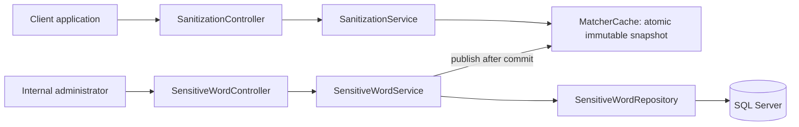
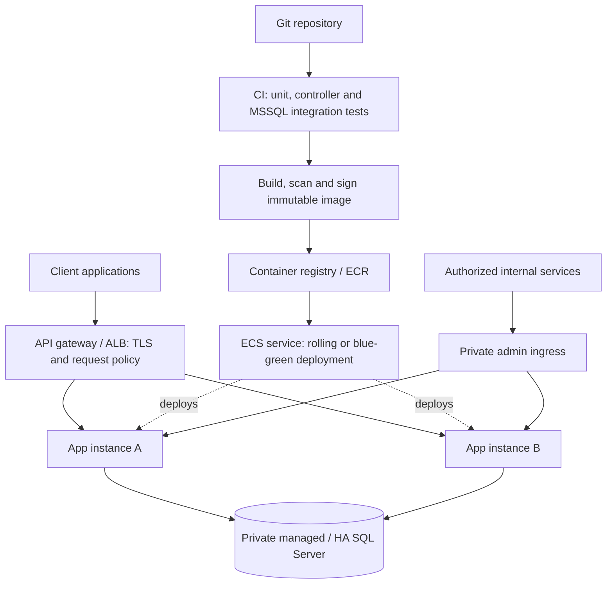

# Flash Sensitive Words API

A Java 21 / Spring Boot service that replaces configured sensitive terms in chat messages with stars. Microsoft SQL Server stores the vocabulary; sanitization uses an immutable in-memory matcher. Administrative CRUD updates the database and replaces the local matcher after a successful commit.

## Quick start

From the repository root, with Docker Engine/Desktop running in Linux-container mode:

```sh
docker compose up --build
```

The first run downloads SQL Server and Java images and Maven dependencies. Allow a few minutes. SQL Server needs an x86-64 host and sufficient memory; allocate at least 4 GB to Docker for this local stack, preferably 6 GB when also running integration tests. Compose uses SQL Server Developer edition for development/testing only. Starting the SQL Server container accepts Microsoft's container license terms.

Compose waits for SQL Server's health check, creates the `sensitive_words` database through a one-shot initialization service, then starts the application. Flyway creates the schema and inserts all 228 supplied entries. An exited `db-init` container with exit code 0 is expected.

| Resource | URL |
| --- | --- |
| Swagger UI | http://localhost:8080/swagger-ui.html |
| OpenAPI JSON | http://localhost:8080/v3/api-docs |
| Health | http://localhost:8080/actuator/health |
| Liveness | http://localhost:8080/actuator/health/liveness |
| Readiness | http://localhost:8080/actuator/health/readiness |

```sh
curl -sS http://localhost:8080/api/v1/sanitize \
  -H 'Content-Type: application/json' \
  -d '{"text":"SELECT * FROM sensitiveWords"}'
```

```json
{"original":"SELECT * FROM sensitiveWords","sanitized":"****** * FROM sensitiveWords"}
```

On Windows PowerShell, use the native equivalent to avoid shell-specific curl quoting:

```powershell
Invoke-RestMethod http://localhost:8080/api/v1/sanitize -Method Post `
  -ContentType 'application/json' -Body '{"text":"SELECT * FROM sensitiveWords"}'
```

## Assessment requirements

The original [PDF](docs/assessment/Interview-SqlWords.pdf) and [word list](docs/assessment/sql_sensitive_list.txt) are retained in the repository. Both were read before implementation. MSSQL follows the email requirement, even though the PDF permits a database of choice.

| Requirement | Implementation |
| --- | --- |
| Java / REST | Java 21, Spring Boot 3.5.16, versioned controllers |
| External business endpoint | `POST /api/v1/sanitize` |
| Internal database CRUD | `/api/v1/internal/sensitive-words` |
| MSSQL | SQL Server 2022 CU26, Spring Data JPA, Microsoft JDBC driver |
| Schema and preload | Flyway V1/V2; Hibernate schema validation |
| Swagger | Springdoc 2.8.17; operations, DTOs, examples, parameters and error codes |
| Unit/controller tests | JUnit 5, Mockito, AssertJ, MockMvc, JaCoCo report |
| Database integration tests | Opt-in MSSQL Testcontainers suite; no H2 substitute |
| Performance | Compiled immutable matcher, no database query per message |
| Deployment | Multi-stage non-root image, Compose health checks, production walkthrough below |

Spring Boot 3.5.16 is the stable 3.x release selected for this assessment, rather than changing the required major version. Java 21 is within its [documented compatibility range](https://docs.spring.io/spring-boot/3.5/system-requirements.html). Springdoc 2.8.x follows the [Boot 3.5 compatibility matrix](https://springdoc.org/v2/#what-is-the-compatibility-matrix-of-springdoc-openapi-with-spring-boot). Spring Boot manages the remaining platform dependency versions. Reassess supported versions and security advisories before production deployment.

## Architecture and data flow



`api` handles HTTP and validation, `application` handles orchestration, `matcher` handles matching and atomic publication, and `persistence` handles JPA. Records in `dto` define explicit API contracts; entities never leave the application layer. `exception` provides centralized ProblemDetail responses, and `config` contains typed settings and OpenAPI configuration. DTO conversion is a small named factory; a separate mapping framework or interface hierarchy would add little here.

At startup, Flyway migrates the database, Hibernate validates it, and an application runner loads the vocabulary and compiles the matcher. Initialization failure stops startup. Until initialization completes, sanitization returns 503 rather than passing messages through an empty matcher. Spring Boot only declares the application ready after the runner completes.

For each message, the application validates the text, reads the atomic matcher reference once, and uses a request-local regex `Matcher`. No database access, shared mutable matching state or application lock is needed on this path. The response includes the original text because that is the requested API contract; neither message value is routinely logged.

CRUD writes are serialized within one instance. A `TransactionTemplate` explicitly owns the transaction and its commit boundary. The operation flushes the database changes, reads the resulting terms and compiles a replacement inside that transaction. Only after the commit succeeds is the replacement published. This avoids publishing rolled-back data, avoids a fallible database reload after commit, and prevents concurrent local writes from publishing snapshots out of order. A compilation or commit failure leaves the previous matcher intact. An in-flight reader may finish with its old snapshot; subsequent readers see the replacement after the CRUD response.

This costs a complete vocabulary read and compilation per administrative write, which is reasonable for 228 terms and rare updates. It is not a distributed transaction: if the process dies immediately after commit, it reloads committed configuration on restart. Multi-instance synchronization is a separate production concern described below.

## Matching semantics and the supplied ambiguity

Terms are literal strings, not regular expressions. They are stripped of surrounding Java whitespace and normalized with `Locale.ROOT` lowercase for duplicate detection. `CREATE`, `create` and ` Create ` are the same configured value. The stored display word keeps its case. The matcher uses Java's Unicode-aware case-insensitive regex matching; it does not transliterate, remove accents, normalize composed/decomposed Unicode, or equate all linguistic spellings. The supplied ASCII vocabulary avoids these linguistic edge cases.

Matching proceeds left to right with non-overlapping matches. At the **same starting position, the shortest complete matching term wins**, with lexicographic ordering as a deterministic tie-breaker. Boundaries treat Unicode letters, numbers, combining marks and connector punctuation (including underscore) as token characters. Thus `ORDER` does not match inside `preorder`, and `CREATE` does not match `CREATE_table`, `CREATE2` or `éCREATE`. Punctuation around a complete term is preserved.

Each non-whitespace Unicode code point in a matched span becomes one `*`; whitespace inside a phrase is preserved. Characters outside the span are copied exactly. A supplementary character such as an emoji becomes one star, so UTF-16 length need not be preserved. Phrase whitespace is literal: `top secret` does not match `top  secret`. Configured punctuation is literal and is masked when it belongs to a matched term.

**The source files overlap:** the list includes both `SELECT` and `SELECT * FROM`, but Flash's PDF explicitly shows `****** * FROM sensitiveWords`. That behavioral example is treated as canonical. Shorter-first matching consumes `SELECT`, leaving ` * FROM sensitiveWords` unchanged; `FROM` is not an independent entry in the supplied list. The phrase remains present in the database and is not silently discarded. If `SELECT` is removed, the phrase can match and produces `****** * **** sensitiveWords` instead. This is a deliberate trade-off, not an inferred longest-phrase rule.

Precedence is localized in `SensitiveWordMatcher.compile`; clarification can change the ordering and associated tests without changing the API or database. This rule is based on the start position, not a global preference for any short word anywhere within an overlapping phrase.

| Input | Output with the supplied dataset |
| --- | --- |
| `CREATE` / `create` / `CrEaTe` | `******` |
| `Please CREATE a TABLE` | `Please ****** a *****` |
| `CREATE x CREATE` | `****** x ******` |
| `CREATE, DROP!` | `******, ****!` |
| `preorder ORDER` | `preorder *****` |
| `SELECT * FROM sensitiveWords` | `****** * FROM sensitiveWords` |

This is chat-content filtering, not SQL-injection protection. Database access uses JPA parameter binding. Applications must still use parameterized SQL regardless of this service's output.

## API

All request bodies use `application/json`. Unknown JSON properties are rejected to catch consumer mistakes. Text must be non-null, non-blank and at most `SANITIZATION_MAX_MESSAGE_LENGTH` UTF-16 units (default 10,000; configurable from 1 to 1,000,000). Terms must contain 1–200 characters, have no internal control characters, and cannot consist only of whitespace. The HTTP term field has a 200-unit limit including surrounding whitespace; application normalization then strips that whitespace. IDs must be positive. Collection pages are zero-based with size 1–100, ordered by ascending ID.

| Method | Path | Success |
| --- | --- | --- |
| POST | `/api/v1/sanitize` | 200, original and sanitized text |
| POST | `/api/v1/internal/sensitive-words` | 201, DTO and `Location` header |
| GET | `/api/v1/internal/sensitive-words?page=0&size=20` | 200, content and page metadata |
| GET | `/api/v1/internal/sensitive-words/{id}` | 200, DTO |
| PUT | `/api/v1/internal/sensitive-words/{id}` | 200, updated DTO |
| DELETE | `/api/v1/internal/sensitive-words/{id}` | 204, no body |

CRUD examples (POSIX shell; replace `229` with the returned ID):

```sh
curl -i http://localhost:8080/api/v1/internal/sensitive-words \
  -H 'Content-Type: application/json' -d '{"word":"CONFIDENTIAL"}'
curl -sS 'http://localhost:8080/api/v1/internal/sensitive-words?page=0&size=20'
curl -sS http://localhost:8080/api/v1/internal/sensitive-words/229
curl -sS -X PUT http://localhost:8080/api/v1/internal/sensitive-words/229 \
  -H 'Content-Type: application/json' -d '{"word":"CLASSIFIED"}'
curl -i -X DELETE http://localhost:8080/api/v1/internal/sensitive-words/229
```

The collection uses Spring Data's `PagedModel`, avoiding unstable serialization of `PageImpl`:

```json
{"content":[{"id":1,"word":"ACTION","createdAt":"2026-09-10T00:00:00Z","updatedAt":"2026-09-10T00:00:00Z"}],"page":{"size":1,"number":0,"totalElements":228,"totalPages":228}}
```

Errors use `application/problem+json`: 400 for validation/malformed requests, 404 for missing resources (including a second delete), 409 for normalized duplicates, 415 for unsupported request content type, and 500 for unexpected failures. SQL Server duplicate-key codes are mapped to 409 even when a race passes the application's preliminary check. Other integrity failures remain 500. SQL, stack traces and internal exception names are never included in error responses.

```json
{"type":"about:blank","title":"Conflict","status":409,"detail":"A sensitive word with the same normalized value already exists","instance":"/api/v1/internal/sensitive-words"}
```

## Database and supplied word list

`V1__create_sensitive_words.sql` creates a bigint identity primary key, `NVARCHAR(200)` display and normalized values, a unique normalized-value constraint and UTC `DATETIME2(6)` timestamps. Binary collation on the normalized key avoids the database's default accent/case collation introducing a different comparison rule. Non-null, column-size and nonblank checks complement application validation. There is no active flag: all persisted terms are effective, and DELETE physically removes a term.

`V2__seed_sensitive_words.sql` was generated directly from the supplied JSON-format `.txt` file, without substitutions. The seed test compares every inserted display value and normalized value with that source. Seed migration runs once; restarting does not restore deleted terms or duplicate rows. Never edit an applied migration; use a new version for subsequent changes. Hibernate uses `ddl-auto: validate` and does not own schema changes.

Use the administrative API for configuration changes. Direct SQL edits bypass normalization and local refresh and are not a supported configuration workflow. Database uniqueness still protects the normalized key from concurrent duplicate inserts. The local stack uses `sa` for convenient initialization/migration; this is not the production privilege model.

## Local development and Docker operations

No host JDK or Maven is needed for Compose. For development outside the app container, install JDK 21 and use Maven 3.6.3+ or the included Maven 3.9.11 wrapper:

```sh
docker compose up -d sqlserver db-init
export DB_PASSWORD='FlashLocal_Only!2026'
./mvnw spring-boot:run
```

PowerShell:

```powershell
docker compose up -d sqlserver db-init
$env:DB_PASSWORD = 'FlashLocal_Only!2026'
.\mvnw.cmd spring-boot:run
```

If the Compose application already occupies port 8080, stop it with `docker compose stop app` first. Local JDBC defaults connect to `localhost:1433/sensitive_words`; wait for `db-init` to exit successfully before launching the host application.

| Environment variable | Purpose / default |
| --- | --- |
| `DB_URL` | JDBC URL; defaults to local SQL Server with encryption and development certificate trust |
| `DB_USERNAME` | Application DB identity; defaults to `sa` for local development |
| `DB_PASSWORD` | Required when running outside Compose; no application password default |
| `DB_POOL_SIZE` | Hikari maximum connection pool size; 10 |
| `SANITIZATION_MAX_MESSAGE_LENGTH` | Text limit; 10,000 UTF-16 units |
| `MSSQL_SA_PASSWORD` | Compose development password; public local-only default |
| `MSSQL_PORT` / `APP_PORT` | Compose host ports; 1433 / 8080 |

Optionally copy `.env.example` to `.env` to override Compose values. `.env` is ignored by Git. The default password is deliberately public and suitable only for a disposable local database. Both exposed ports bind to loopback. Changing the environment password does not change the existing SQL Server login in a persisted volume: rotate it inside SQL Server or use a new local volume.

```sh
docker compose ps -a
docker compose logs -f app
docker compose down
```

`down` preserves the named database volume. To intentionally erase only this local stack's data and rerun initial seeding, use `docker compose down -v`, then start it again. This deletes local CRUD changes. Do not use it against production data.

The Docker build runs the normal test suite, then copies only the packaged application into a Java 21 JRE image. The runtime uses a non-root user and a readiness health check. Base image versions are selected explicitly, though tags can be republished; pin approved image digests in a production release pipeline. Compose is a reviewer/development setup, not a production deployment platform.

## Testing

```sh
mvn clean verify
# Equivalent without a Maven installation:
./mvnw clean verify
# Windows:
.\mvnw.cmd clean verify
```

The normal suite needs JDK 21 and initial Maven repository access, but no database or Docker. It tests matching semantics, the complete source seed, application validation, CRUD orchestration, transaction rollback/commit ordering, concurrent matcher publication and HTTP contracts. JaCoCo writes `target/site/jacoco/index.html`; Surefire writes `target/surefire-reports`. Tests exercise business behavior rather than generated record accessors.

For actual MSSQL, Docker must be running:

```sh
mvn clean verify -Pintegration
```

The profile adds Failsafe `*IT` tests that create an isolated SQL Server container on a random port and remove it afterward. They verify Flyway and Hibernate compatibility, every supplied seed value, database constraints, complete CRUD with live matcher refresh, simultaneous writes, Swagger/OpenAPI and health. No H2 is used. The profile fails if Docker is unavailable; no tests silently disable themselves. Keeping this explicit means the default assessment build remains easy to run on reviewers' machines. Running tests accepts the SQL Server image license for the disposable test instance.

The GitHub Actions workflow runs the normal suite and the MSSQL integration profile on a Linux runner. Actual throughput claims require a separate benchmark; coverage and concurrency tests do not establish a requests-per-second target.

See the [local verification record](docs/verification.md) for executed checks and their scope.

## Performance: what would enhance this project?

**Implemented now:** the normal sanitization path is a single in-memory snapshot read and compiled literal regex match. Pattern compilation and full-vocabulary database reads happen at startup and configuration writes. Each request owns its regex state, so readers need no lock. An unchanged message returns its original string. Request length and page size are bounded; database collection reads are paginated; Hikari pools connections; the normalized-key unique index serves duplicate checks. Logging records configuration operations without chat bodies.

**Next, measure:** load-test realistic message sizes, match density, vocabulary size and concurrent writes. Record p50/p95/p99 latency, CPU, allocations, GC pauses and refresh duration. Compare results with the latency/throughput target before altering the algorithm. Regex work can grow with both message length and vocabulary size; literal quoting prevents administrator-supplied regex syntax, but does not make scanning free.

If matching dominates CPU at substantially larger vocabularies, benchmark a trie or Aho-Corasick matcher against this implementation, keeping the same boundaries, Unicode and precedence semantics. If GC dominates, profile the result builder and per-match substring allocations before reducing them. Avoid caching chat messages or responses without a privacy and invalidation design.

If administrative traffic grows, benchmark batch imports and one rebuild per batch. For large lists, investigate keyset pagination rather than arbitrarily deep offset pages. Tune connection pools from measured database concurrency: increasing a pool cannot improve the database-free sanitize path and can overload MSSQL. Keep indexes small and query-driven.

For higher total request volume, add instances behind a load balancer **after** solving matcher synchronization. Set CPU/memory limits, JVM heap headroom and autoscaling thresholds from metrics rather than guesses. Rate-limit abusive clients and enforce an HTTP body-byte limit at the gateway: Bean Validation runs after JSON decoding, so the current character limit is not a transport memory cap. Sampling operational logs reduces I/O while preserving useful failure signals.

## Multiple application instances

Each process owns its matcher. This implementation refreshes the instance handling CRUD; other instances retain their old matcher until restarted. Compose therefore runs one app instance. Horizontal scaling without an invalidation policy would be incorrect for prompt propagation requirements.

A modest next step is a database configuration-version row incremented in the same transaction as each edit. Instances periodically check that small value, loading and publishing a consistent vocabulary/version snapshot when it changes. Polling introduces a bounded delay and modest DB traffic; make the interval, retry behavior and stale-age readiness policy explicit. Read the version and terms consistently so a refresh cannot mark an older vocabulary as a newer version.

If Flash requires shorter propagation delays or has many instances, publish invalidation events through existing pub/sub infrastructure and retain version reconciliation for missed events. A transactional outbox can close the commit/event gap. A distributed cache or configuration service may be appropriate if already operated at Flash, but adds availability and operational dependencies. None of these is implemented here. Choose based on consistency requirements, update frequency, instance count, allowed propagation delay and existing infrastructure; do not add Kafka or Redis solely for 228 terms.

## Additional enhancements: what would make it more complete?

| Implemented now | Production / future work and why |
| --- | --- |
| Internal route namespace, loopback-only local ports | Enforce administrative authorization with OAuth2/JWT scopes or mTLS/service identity; a URL prefix alone is not access control |
| Validation, safe ProblemDetail responses, literal matching | Gateway rate limits and body-byte limits to bound abuse before parsing |
| Atomic local refresh and failure-safe transactions | Distributed invalidation and audit history: know who changed a term and when each instance applied it |
| Parameterized operational logs, health probes | Correlation IDs, tracing, restricted metrics dashboards and centralized logs with retention/redaction rules |
| Unit/controller tests and real MSSQL integration suite | Consumer contract tests, repeatable load tests, static analysis and dependency/container vulnerability scanning |
| CI verification workflow and container packaging | Approved artifact promotion, signed images, automated deployment and rollback gates |
| Flyway versioning and graceful shutdown | Expand/contract schema changes, backup-restore drills, SQL Server HA and disaster recovery |

No authentication, authorization, audit trail, cross-instance refresh, distributed tracing or automatic retries for CRUD is claimed as implemented. Retrying a write after a network failure requires checking whether it committed; an idempotency design would be preferable to blanket retries.

## Production deployment walkthrough



1. **Agree the service contract and consistency target.** Confirm phrase precedence, permitted Unicode behavior, peak traffic and vocabulary propagation delay. Implement the chosen multi-instance version/invalidation policy before running multiple replicas. Define SLOs and how stale configuration affects readiness.
2. **Verify and package in CI.** Run `mvn clean verify -Pintegration`, contract checks and security scans on a Docker-capable runner. Build once, tag by Git SHA, scan/sign, and push to ECR. Promote the same digest through staging and production; do not rebuild per environment. The supplied CI covers verification; registry publication and deployment require Flash's credentials and approvals.
3. **Provision a private database.** Use a supported SQL Server deployment with appropriate production licensing, HA/failover, encrypted storage, automatic backups and point-in-time recovery. Set retention against RPO/RTO and prove restoration in drills. Size from measured workload. Keep SQL Server private; only migration jobs, app identities and approved operations tooling can connect.
4. **Separate migration from runtime privilege.** Create the database through infrastructure provisioning. Run Flyway once as a controlled release job with a dedicated DDL identity. Application identities need only the required table reads/writes, not `sa` or schema-owner permissions. Disable in-app Flyway with `SPRING_FLYWAY_ENABLED=false` after the release migration; keep Hibernate validation. Use backward-compatible expand/contract migrations so old and new app versions coexist during rollout. Never use destructive automatic migration repair or schema generation.
5. **Configure identities, secrets and network policy.** Inject DB credentials from a secrets manager, rotate them with tested pool rollover, and use TLS with real certificate validation (`encrypt=true;trustServerCertificate=false`). Give each task minimal IAM permissions. Put application tasks in private subnets. The public listener must route only the external business endpoint; block `/api/v1/internal/**`. Expose CRUD through private ingress with JWT authorization or mTLS and least-privilege policies. Protect or disable Swagger in production. Restrict health and metrics ingress separately. The local app itself has no auth enforcement.
6. **Deploy to ECS (or Flash's existing platform).** Run the non-root container with measured CPU/memory limits and a read-only root filesystem where possible, allowing temporary storage for the JVM. Terminate client TLS at the approved gateway/ALB and use internal TLS if required. Configure payload limits, rate limiting, request timeouts and connection draining. Route only to `/actuator/health/readiness`-healthy tasks; liveness must not restart every task merely because SQL Server is temporarily down. Readiness includes DB connectivity and startup completion in this implementation.
7. **Roll out and observe.** Use a rolling or blue-green rollout, keeping enough healthy capacity while new tasks migrate/validate and load matchers. Smoke-test sanitization, CRUD authorization and vocabulary propagation. Watch request rate, latency percentiles, errors, JVM/GC, pool wait time, DB health, refresh duration and configuration version/age. Alert on sustained SLO breaches, failed refreshes, stale matchers and database failures. Do not store chat bodies in routine logs.
8. **Rollback safely.** Keep the previous image digest and deployment definition. Abort a rollout when health or latency gates fail; restore the prior image while respecting schema compatibility. Rolling back code does not reverse a database migration or administrative vocabulary change. Prefer a forward database fix; restore backups only under a planned recovery procedure with explicit data-loss implications. Test failover, recovery and credential rotation before they become incidents.

The in-memory matcher can continue matching during a database outage, but this implementation deliberately marks readiness down when DB health fails because configuration freshness and CRUD cannot be assured. A read-availability-first policy could instead allow a last-known-good snapshot for a defined maximum age; that needs an explicit product/SLO decision, not an accidental health setting.

## Assumptions and trade-offs

- Flash's explicit PDF example is canonical despite the overlapping supplied phrase. The phrase remains seeded and configurable.
- Vocabulary updates are rare, so simple serialized local writes and full rebuilds are preferable to a complex concurrent incremental matcher.
- Updates are last-write-wins; there is no edit version/ETag for preventing an administrator from overwriting another administrator's stale edit. Add optimistic concurrency if that workflow requires it.
- One application instance is supported for immediate configuration visibility. Cross-instance synchronization is a documented production prerequisite, not a hidden implemented feature.
- No active flag, custom security server, message broker, frontend or orchestration manifests are needed for this assessment.
- The required original-text response is useful to consumers but can contain private data. Consumers must apply their own response logging/redaction policy.
- Default verification intentionally runs without Docker. The separate integration profile is required in the production CI gate and fails loudly when Docker cannot run.
